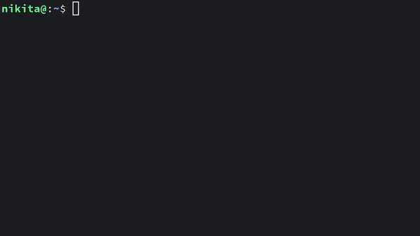

# ictree

Like tree but interactive

----

Sometimes I need to find some file with `locate` or `find`.
I use the command but, instead of getting several lines of output that are easy to look through, I get hundreds of them...
Then I try to pipe that mess into `tree --fromfile . | less`, hoping that it will be less of a pain to find what I'm looking for. But it's not always the case: you cannot fold directories you're not interested in within less, so you have to hold ^F...

I got sick of it and made this simple program that takes a list of contents of directories and provides a terminal interface where you can fold/unfold items and jump between them quickly.



The program is written in C using awesome [termbox2](https://github.com/termbox/termbox2) library for rendering UI.

## Installation

### Manual

```sh
git clone --recursive https://github.com/NikitaIvanovV/ictree
cd ictree
sudo make install
```

Uninstall with `sudo make uninstall`

*Warning: don't forget to add `--recursive` option to `git clone` command!
Otherwise, you will get `No such file or directory` errors while compiling.

### AUR

If you are an Arch Linux user, you can install [`ictree`](https://aur.archlinux.org/packages/ictree/) AUR package.

```sh
yay -S ictree
```

## Usage

Basic usage:

```sh
locate something | ictree
find | ictree
```

ictree can also read from a file:

```sh
ictree list.txt
```

Once you invoke the command, the UI should pop up.
You can toggle folding of directories by hitting `Enter`.
You can move around with arrow keys but if you know the Vi commands, they are supported too!

You can press `y` to copy a selected item into X clipboard.
Note that you must have `xsel` installed to use the command.

You also can press `o` to write a path to standard output and exit program.
It may be useful in a system without X environment.

Please read the manual (`man ictree`) for more details on existing commands and options.

## License

This project is licensed under [GPLv3](https://www.gnu.org/licenses/).
Please refer to the [LICENSE](LICENSE) for more information.
